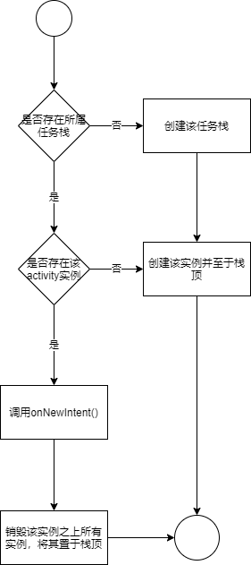
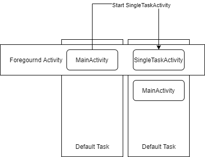
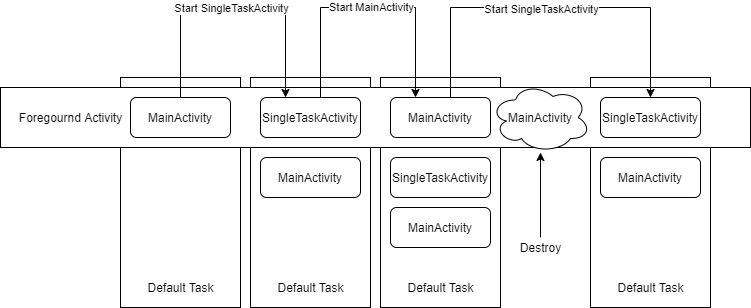
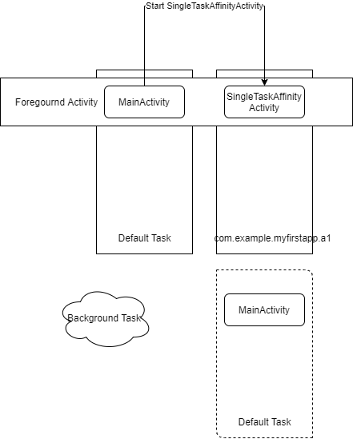
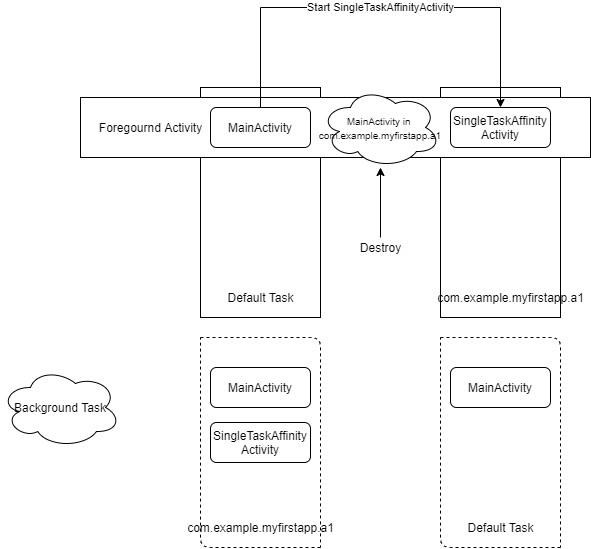

# 1. 总结

启动模式为`singleTask`的activity启动时，系统首先寻找内存中是否存在该activity所属的任务栈(task) (即在`manifest`文件中对应的`<activity>` 声明的`taskAffinity`属性值)，若存在该任务栈，则在任务栈中寻找是否已经存在该activity的实例，若存在该实例，则调用该实例的`onNewIntent()`方法并销毁任务栈中该实例之上的所有实例；若不存在该实例，则创建该实例并置于栈顶；若不存在对应的任务栈，则首先创建该任务栈，并在新建任务栈中创建该activity的实例。**一个任务栈中只能存在一个实例对象**。创建流程如图1所示。

> 未声明`taskAffinity`时，所有的activity默认从属于同一个任务栈，即应用启动时所创建的任务栈。



# 2. 图解

现有三个activity，`MainActivity`, `SingleTaskActivity`, `SingleTaskAffinityActivity`, 其中`SingleTaskActivity` 和`SingleTaskAffinityActivity` 的启动模式都是`singleTask`, 但是`SingleTaskAffinityActivity`设置了它的`taskAffinity`为另一个任务栈. `Manifest`中声明代码如下

```xml
<application
   ...>
     <activity android:name=".SingleTaskAffinityActivity"
         android:launchMode="singleTask"
         android:taskAffinity="com.example.myfirstapp.a1"/>
     <activity android:name=".SingleTaskActivity"
         android:launchMode="singleTask"/>
     <activity android:name=".MainActivity">
        <intent-filter>
            <action android:name="android.intent.action.MAIN" />

            <category android:name="android.intent.category.LAUNCHER" />
        </intent-filter>
    </activity>
</application>
```

## 2.1 启动singleTask (无taskAffinity)

启动应用后，系统当前任务栈如下图：


当`MainActivity`启动`SingleTaskActivity`时，由于`SingleTaskActivity`没有设置`taskAffinity`，**因此其默认`taskAffinity`为系统默认任务栈**，所以系统在当前任务栈中寻找是否已经存在`SingleTaskActivity`的实例。不存在则创建这个activity的实例并置于栈顶，如下图所示：



其运行日志如下：

```java
2021-04-04 22:45:03.650 17626-17626/com.example.myfirstapp I/System.out: MainActivity Create. Task Id: 43112
2021-04-04 22:45:14.365 17626-17626/com.example.myfirstapp I/System.out: SingleTaskActivity Create. Task Id: 43112
2021-04-04 22:45:14.803 17626-17626/com.example.myfirstapp I/System.out: MainActivity Stop. Task Id: 43112
```


如果当前栈中存在`SingleTaskActivity`的实例，则调用该实例的`onNewIntent()`方法，并清空任务栈中该实例之上的所有activity实例将其至于栈顶。其调用图如下所示：



其运行日志如下：

```java
2021-04-04 22:45:03.650 17626-17626/com.example.myfirstapp I/System.out: MainActivity Create. Task Id: 43112
2021-04-04 22:45:14.365 17626-17626/com.example.myfirstapp I/System.out: SingleTaskActivity Create. Task Id: 43112
2021-04-04 22:45:14.803 17626-17626/com.example.myfirstapp I/System.out: MainActivity Stop. Task Id: 43112
2021-04-04 22:45:27.204 17626-17626/com.example.myfirstapp I/System.out: MainActivity Create. Task Id: 43112
2021-04-04 22:45:27.614 17626-17626/com.example.myfirstapp I/System.out: SingleTaskActivity Stop. Task Id: 43112
2021-04-04 22:45:32.225 17626-17626/com.example.myfirstapp I/System.out: SingleTaskActivity onNewIntent. Task Id: 43112
2021-04-04 22:45:32.620 17626-17626/com.example.myfirstapp I/System.out: MainActivity Stop. Task Id: 43112
2021-04-04 22:45:32.621 17626-17626/com.example.myfirstapp I/System.out: MainActivity Destroy. Task Id: 43112
```


## 2.2 启动singleTask (声明taskAffinity)

`taskAffinity`表示activity在应用中所属的任务栈。

启动应用后，系统当前任务栈如下图：


当`MainActivity`启动`SingleTaskAffinityActivity`时，`SingleTaskAffinityActivity`所属的任务栈为**`com.example.myfirstapp.a1`**(见上述代码片段)。由于系统中没有改任务栈，因此系统创建一个新的任务栈，并在改任务栈中创建`SingleTaskAffinityActivity`的实例对象。将新建的任务栈转为前台任务栈，原先的任务栈改为在后台运行。



其运行日志如下：

```java
2021-04-04 22:46:01.608 19083-19083/com.example.myfirstapp I/System.out: MainActivity Create. Task Id: 43113
2021-04-04 22:46:10.912 19083-19083/com.example.myfirstapp I/System.out: SingleTaskAffinityActivity Create. Task Id: 43114
2021-04-04 22:46:11.427 19083-19083/com.example.myfirstapp I/System.out: MainActivity Stop. Task Id: 43113
```


如果内存中存在`com.example.myfirstapp.a1`任务栈，`MainActivity`启动`SingleTaskAffinityActivity`时，系统则会调用`SingleTaskAffinityActivity`的`onNewIntent()`方法并销毁`com.example.myfirstapp.a1`任务栈中在该实例对象之上所有的实例，并将`SingleTaskAffinityActivity`的实例对象置于栈顶。同时系统将`com.example.myfirstapp.a1`设置为前台任务栈，将原先任务栈转为后台运行。



其运行日志如下：

```java
2021-04-04 22:46:01.608 19083-19083/com.example.myfirstapp I/System.out: MainActivity Create. Task Id: 43113
2021-04-04 22:46:10.912 19083-19083/com.example.myfirstapp I/System.out: SingleTaskAffinityActivity Create. Task Id: 43114
2021-04-04 22:46:11.427 19083-19083/com.example.myfirstapp I/System.out: MainActivity Stop. Task Id: 43113
2021-04-04 22:46:33.892 19083-19083/com.example.myfirstapp I/System.out: MainActivity Create. Task Id: 43114
2021-04-04 22:46:34.304 19083-19083/com.example.myfirstapp I/System.out: SingleTaskAffinity Stop. Task Id: 43114
2021-04-04 22:46:48.987 19083-19083/com.example.myfirstapp I/System.out: MainActivity Stop. Task Id: 43114
//以上为前期准备日志
//以下为上图流程日志
2021-04-04 22:46:53.976 19083-19083/com.example.myfirstapp I/System.out: MainActivity Destroy. Task Id: 43114
2021-04-04 22:46:53.999 19083-19083/com.example.myfirstapp I/System.out: SingleTaskAffinityActivity onNewIntent. Task Id: 43114
2021-04-04 22:46:54.567 19083-19083/com.example.myfirstapp I/System.out: MainActivity Stop. Task Id: 43113
```

## 2.3 使用FLAG_ACTIVITY_NEW_TASK启动

启动应用后，系统当前任务栈如下图：


当`MainActivity`使用`FLAG_ACTIVITY_NEW_TASK`启动`MainActivity`时