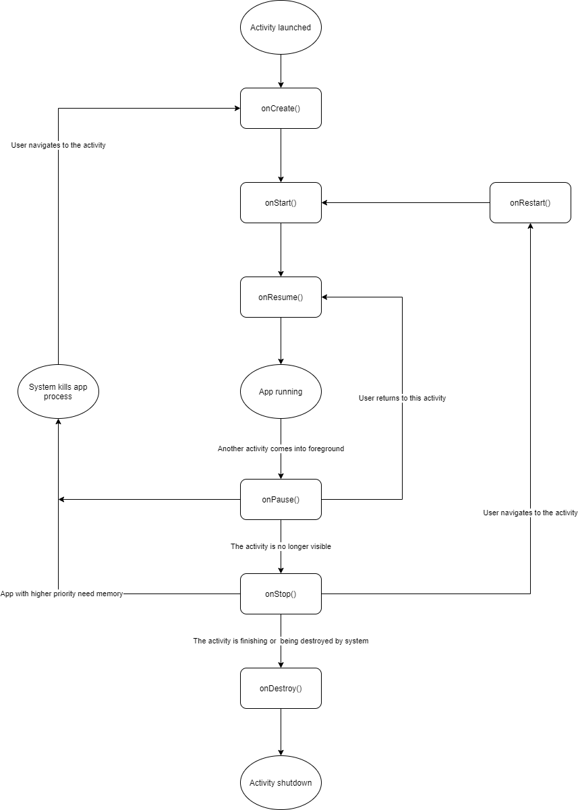
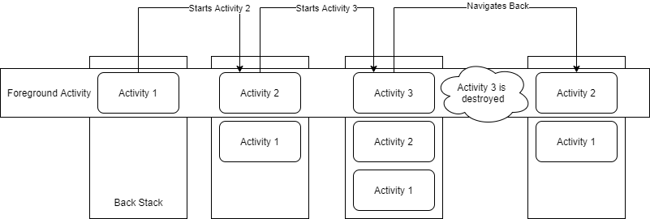
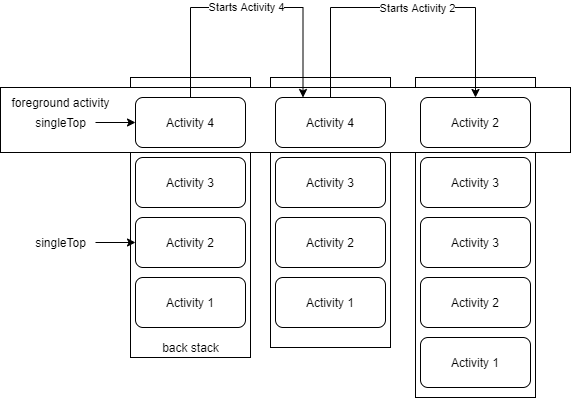

# 1. Activity

## 1. Activity Lifecycle

### 1.1 Concept

Android provides six callbacks in an activity lifecycle, i.e. `onCreate()`, `onStart()`, `onResume()`, `onPause()`, `onStop()`, `onDestroy()`.

Below is the lifecycle diagram:



The system invokes these callbacks as an activity enters a new state.

When user leaving the activity, system calls the callback method to dismantle activity, but the dismantlement only partial. That is the activity still resides in memory, when user returns to the activity, it can come back where user left.

### 1.2 Lifecycle Callbacks

#### 1.2.1

must implement this

create activity

Create state

basic setup

savedInstanceState

ON_CREATE event

enters Started state after finishing  

#### 1.2.2

Started state

prepare make activity visible to user

ON_START event

enters Resumed state after finishing

#### 1.2.3

Resumed state

comes to foreground

the state that the app interacts with user

stays in this state until

ON_RESUME event

enters Paused state

returns Resumed state from Paused state

release resource in corresponding event

#### 1.2.4

call when user is leaving the activity

no longer in foreground

ON_PAUSED event

release system resource

execute very brief, no enough time to save

heavy-load shutdown operations in ___

stay in Paused state until resume or completely invisible

#### 1.2.5

Stopped state

no longer visible

ON_STOP event

release or adjust resource

CPU-intensive shutdown operation

system track View object

when activity go back, it calls \__, otherwise it calls __

#### 1.2.6

destroyed state

activity finish, configuration change

ON_DESTROY event

isFinishing()

### 1.3 Activity State and Ejection from Memory

likelihood of being killed

kill the process that activity runs

### 1.4 Saving and Restoring Transient UI State

#### 1.4.1 Instance State

normal app behavior, back button or finish()

destroyed due to system constraints, system remember it existed

recreate the activity using Bundle object

Bundle object is not appropriate to preserve more than a trivial amount of data

use other method to preserve more information

#### 1.4.2 Save Simple, Lightweight UI State Using onSaveInstanceState()

by default, onSaveInstanceState() save state of activity's view hierarchy

save additional information, overwrite the onSaveInstanceState()

callback will not be called when closed explicitly

#### 1.4.3 Restore Activity UI State Using Saved Instance State

recreate activity using Bundle object. onCreate(), onRestoreInstanceState()

in onCreate(), check if it is new create or recreate

onRestoreInstanceState(), called after onStart(), only be called if there is a saved state to restore

### 1.5 Navigating between Activities

#### 1.5.1 Starting One Activity from Another

##### 1.5.1.1

start an activity without needing its result

```java
Intent
```

##### 1.5.1.2

start an activity need its result

child activity: setResult(int)  return an Intent

parent activity: onActivityResult(int, int, Intent)

```java
result
```

##### 1.5.1.3 Coordination Activities

first activity is not completely stopped before second one is created, the process of them are overlap

the order of operation that occurs when activity A starts activity B:

### 1.6 Q&A

#### 1.6.1 What's mean of activity is no longer visible? When will call onStop() callback?

## 2. Handle Activity State Changes

### 2.1 Configuration Change Occurs

When configuration change occurs, the activity is destroyed and recreated, the original activity instance will trigger `onPause()`, `onStop()`, `onDestroy()`, and the new instance will trigger `onCreate()`, `onStart()`, `onResume()`.

#### 2.1.1 Handling Multi-window Cases

When the app change to multi-window mode, the system will notify the app there is a configuration change, thus the current activity will go through the workflow describe above, destroy and recreate the activity instance. If the apps are already in multi-window mode but user resizes the window, it is a configuration change, thus the app will destroy and recreate the activity instance as well.

When apps are in multi-window mode, the app which user is interacting with is in foreground and its activity state is `Resumed`, another app is in `Paused` state. If the user change his focus from app A to app B, then app A will trigger `onPause()` method and change to `Paused` state, app B will call `onResume()` method and change to `Resumed` state.


### 2.2 Activity or Dialog Appears in Foreground

#### 2.2.1 Partially Covered

When an new activity or dialog comes to foreground, taking focus and partially covering the current activity, the activity loses focus and enters `Paused` state, call `onPause()` method on it.

When the covered activity comes back to foreground, it calls `onResume()` method and enters `Resumed` state.

#### 2.2.2 Completely Covered

When an new activity or dialog comes to foreground, taking focus and completely covering the current activity, the activity enters `Stopped` state and call `onPause()` and `onStop()` method in a succession.

When the same instance of the covered activity comes back to foreground, it will trigger `onRestart()`, `onStart()` and `onResume()` methods. If it is a new instance (i.e. have been destroyed before) comes back, it only calls `onStart()` and `onResume()`.

***When user presses Overview or Home button, the system behaves as if the activity has been completely covered.***

### 2.3 User Taps Back Button

When user taps back button, the activity in foreground will trigger `onPause()`, `onStop()` and `onDestroy()` callbacks. The method `onSaveInstanceState()` will not fire in this scenario. Because this is based on the assumption that user will not return back the to same instance of the activity.

But we can override the `onBackPressed()` method to do some custom behavior, but it should call `super.onBackPressed()`.

### 2.4 System Kills App Process

The system will kill the app in background to free up some memory for the foreground app.

## 3. Task and Back Stack

### 3.1 Activity Behavior in Task

**Task: a back stack that store activity instance**

When user press the app launcher (the app icon), if there is a task of this app already remain in memory, then this task goes into foreground, if not, then a new task is created and the ***main*** activity instance is created and push onto this task.

The activity order in the back stack will not be rearranged. That means when user presses **Back** button, the activity will show in order in which the activity was opened. 

When an activity starts another activity, that new activity instance will be pushed onto the back stack, and the original activity enters `Stopped` state and the system remains all its state (such as the position of scroll). When user presses **Back** button, the current activity instance pops off from the back stack and the original activity resume to the foreground.

When there is no activity instance exist in the back stack, the task will be destroyed.

Below is the example figure of how activity behavior in task:



### 3.2 Task Behavior

When a task goes to background (via **Home** or **Overview** button ), all activities in that task enter `Stopped` state and remain intact. 

When a background task goes to foreground, the activity on the top of the back stack resumes *with its state restored*.

The system allows multiple tasks stay in memory, but if there are lots of tasks, system may destroy some tasks to free up memory for the foreground task.

An activity instance can be created multiple times in back stack, because an activity can be starts from different activity even from other app.

### 3.3 Managing Tasks

There are two ways to interrupt the normal activity launch behavior:

1. Specify activity launch mode in manifest file
2. Including intent flag when starts an activity

**Intent flag's priority is higher than activity launch mode in manifest file.**

#### 3.3.1 Defining Launch Mode

##### 3.3.1.1 Using Manifest File

When specify the activity in manifest file, you can specify `<activity>`'s `launchMode` attribute to instruct how the activity should be launched into a task.

1. **standard**: ***the default mode***. When user starts the activity, the system will create a new instance of this activity and push it onto the top of the stack from which it was started. The activity can be instantiated multiple times. The activity can exist in multiple tasks, a task can contain multiple instances of this type of activity.

2. **singleTop**: If the user starts the activity which is already on the top of current stack, the system will not create a new instance of it, instead, the system will route the intent to that existing instance through a call to its `onNewIntent()` method. But if the top instance is another activity, the system will instantiate a new instance of the activity. The activity can be instantiated multiple times, each instance can belongs to different tasks, one task can include multiple instances.

   

   > **Note**: if a new instance of activity comes to task, the user can press **Back** button to navigate to previous activity, but when an existing instance handles the intent, the user cannot press **Back** button to review the state before the instance receive the call on `onNewIntent()`

3. **singleTask**: When user starts an activity that is `singleTask`, firstly, the system will look for a task which the activity belongs to. If there is no such a task in memory, then the system will create a new task for that activity and create an activity instance in the new task. If there is a task has affinity with the activity, and if there is no that activity instance in the task, then the system will create an activity instance in that task; if there is already exist an instance of that activity, then the system will route the intent through a call `onNewIntent()` method of that activity and clear all activity instances on the top of that existing instance. This type of activity can only exist one instance in one stack. **Explore more on task affinity**

4. **singleInstance**: The system will create a new task to hold the `singleInstance` activity instance, and will not launch any other activity into the task holding the instance. The activity is always the single and only member of task. Any activity starts by it will open in a separate task.

   > **Note**: This type of activity's instance is global unique.

##### 3.3.1.2 Using Intent Flags

1. **FLAG_ACTIVITY_NEW_TASK**: Produce same behavior as the `singleTask` launch mode when launch the activity, but when create instance it still follows its `launchMode` rule.
2. **FLAG_ACTIVITY_SINGLE_TOP**: Produce same behavior as the `singleTop` launch mode.
3. **FLAG_ACTIVITY_CLEAR_TOP**: If the activity is already running on the current task, then that instance will comes to the top of task and all instances on the top of that instance will be destroyed and the system will route the intent to it through `onNewIntent()` method.

#### 3.3.2 Handling Affinities

The *affinity* defines the activity prefers which task it belongs to. By default, each activity in one app has an affinity for each other. By default,all activities in one app belong to the same task. **The *package* name declared in `<manifest>` element is the default task affinity of all activities in the same app.** Activities in the same app can have different task affinity, different app's activities can share same task affinity.

If we want to change an activity affinity to another task, we can declare the `taskAffinity` attribute in `<activity>` element. And the `taskAffinity` value must be unique from the package name in `<manifest>` element.

The *affinity* comes to play in two circumstances:

1. Start an activity with `FLAG_ACTIVITY_NEW_TASK` flag:

   By default, when we start an activity, it will push onto the task belongs to the activity starts it. But when pass the `FLAG_ACTIVITY_NEW_TASK` to the intent, the system will launch a new task for that new activity. But if there is already existing the task that the activity has the affinity for, the system will use that task and push the activity instance onto that task and make that task comes into foreground.

2. When an activity has it `allowTaskReparenting` attribute set to `true`:

   In this case, the activity can move from the task it starts to the task it has affinity for when that task comes to the foreground.

   When we start an activity that this attribute is true with another app, initially the system will push the activity onto the task it starts. But when that activity's app comes to foreground, the system will reassign the activity to that task and display within it.

#### 3.3.3 Clearing the Back Stack

By default, when a task stay in background for a long time, the system will clear all activities except the root activity of that task. Thus, when user comes back to that task, the task will present the initial state.

1. `alwaysRetainTaskState`

   When a root activity of a task set this attribute as `true`, then no matter how long user leave this task, the system will always retain the state of all activities in this task.

2. `clearTaskOnLaunch`

   When a root activity of a task set this attribute as `true`, then whenever user go back to the task and launch that root activity by clicking the launcher icon, the system will clear down to the root activity, that means the task will return to the initial state when user comes back. But when user go back the task by recent task, all activities still remain in task.

3. `finishOnTaskLaunch`

   When set a activity this attribute as `true`, then when user leave the task and comes back to the task by clicking the launcher icon, then the activity will be destroyed. But when user go back the task by recent task, the activity still presents there.